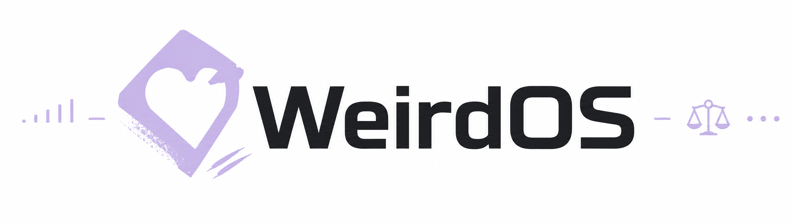

<p align="center">
  
</p>

# WeirdOS

_Repo `aresstack/weirdos-esp32`. „WeirdOS" ist der Produktname (AP-SSID, Hostname `weirdos`); der Repo- und Sketch-Name folgt der Kleinschreib-Konvention._

Modulare ESP32-Firmware (ESP32-**S3** und ESP32-**P4**) für IP-Kamera + LTE-Modem-Host.
Ein einzelner Arduino-Sketch, der eine Kamera bereitstellt, ein USB-LTE-Modem
(Quectel EC200A) als Uplink ansteuert und eine Weboberfläche zum Einrichten,
Streamen und für VPN/Netzwerk mitbringt.

> **Herkunft.** WeirdOS ist die verselbständigte Kopie von
> `Miguel0888/quectel-ec200a-eu` → Unterordner `esp32-modem-host/`. Der Sketch
> wurde beim Herauslösen von `esp32-modem-host.ino` in **`weirdos-esp32.ino`**
> umbenannt und auf die Repo-Wurzel gelegt, damit sich das Repo direkt aus dem
> Git-Ordner flashen lässt (`git clone … weirdos-esp32` → Arduino öffnet den Ordner
> `weirdos-esp32/` mit `weirdos-esp32.ino`, keine Kopie nötig). Die technische
> Sketch-Doku steht unverändert in [`README.sketch.md`](README.sketch.md).
> Provenienz und Lizenzhinweise: [`NOTICE.md`](NOTICE.md).

## Warum dieses Repo existiert

Das Cam-Tool (`Miguel0888/ipcam-lan-discovery`) soll WeirdOS als Grundlage
verwenden und beim Flashen **nur die Module ausliefern, die gebraucht werden**.
Der Grund sind zwei harte Grenzen auf dem ESP32:

1. **Heap** – vor allem auf dem P4. Ungenutzte Module belegen statisches RAM,
   das dem USB-Host/PPP und der Krypto fehlt.
2. **Flash** – der App-Teil läuft voll, je mehr Module fest mitkompiliert werden.

Arduino liefert ungenutzten Code nur dann *nicht* aus, wenn er **gar nicht erst
referenziert** wird. Ein Laufzeitschalter genügt nicht: er kann die statischen
Puffer einer schon gelinkten Bibliothek nicht mehr freigeben (belegt am
TinyUSB-Fall, siehe [`docs/flash-and-heap.md`](docs/flash-and-heap.md)). Deshalb
werden die Module hinter **Compile-Schalter** (`#if WEIRDOS_FEATURE_*`) gelegt
und im Composition Root nur unter ihrem Schalter referenziert.

## Dokumente

| Thema | Datei |
|-------|-------|
| **Echter Modulkatalog** (S3-Kern vs. P4-optional, was Kern werden kann) | [`DECOMPOSITION.md`](DECOMPOSITION.md) |
| **Flash & Heap** – die „gezippt hochladen"-Frage ehrlich beantwortet | [`docs/flash-and-heap.md`](docs/flash-and-heap.md) |
| Sketch-/Hardware-Doku (Board-Settings, USB-Host, Flashen) | [`README.sketch.md`](README.sketch.md) |

## Bauen & Flashen

**Über das Cam-Tool.** Der vorgesehene Weg ist das Cam-Tool
(`Miguel0888/ipcam-lan-discovery`): es kompiliert und flasht über `arduino-cli`.
Der Bedienende muss dafür nur **die Arduino-IDE installiert haben** — das Tool
benutzt die dort mitgelieferte `arduino-cli` (es liefert sie aus GPL-Gründen
nicht selbst mit) und wählt Board/FQBN aus dem Board-Katalog.

**Firmware angeben:** gar nicht nötig. Das GitHub-ZIP dieses Repos (Code →
Download ZIP) entpackt neben die EXE legen — als `weirdos-esp32` oder so, wie
GitHub es nennt, `weirdos-esp32-main` — und das Tool findet es beim Start. Oder
im Tool „ZIP …" (Archiv wählen) bzw. „Von GitHub laden" (holt `main.zip`). In
beiden Fällen benennt das Tool den Ordner auf `weirdos-esp32` um, weil Arduino
verlangt, dass der Ordner so heißt wie die `.ino` darin.

**Manuell** geht genauso, esp32-Core 3.3.11. Beispiel S3:

```
FQBN="esp32:esp32:XIAO_ESP32S3:USBMode=hwcdc,CDCOnBoot=cdc,PSRAM=opi,FlashSize=8M,PartitionScheme=default_8MB"
arduino-cli compile --fqbn "$FQBN" .
arduino-cli upload  --fqbn "$FQBN" -p <PORT> .
```

Beispiel P4 (Waveshare ESP32-P4-Pico, 32 MB Flash + 32 MB PSRAM — der 4-MB-Default des
Cores passt nicht):

```
FQBN="esp32:esp32:esp32p4:FlashSize=32M,PartitionScheme=app13M_data7M_32MB,PSRAM=enabled"
```

**USB-Webcam (Profil `webcam`).** Der USB-Gerätestack braucht die
Board-Option **USB-OTG (TinyUSB)** statt Hardware-CDC, und **CDC beim Start aus**
(die Firmware bringt eigene Deskriptoren mit). Beispiel S3:

```
FQBN="esp32:esp32:XIAO_ESP32S3:USBMode=default,CDCOnBoot=cdc,PSRAM=opi,FlashSize=8M,PartitionScheme=default_8MB"
arduino-cli compile --fqbn "$FQBN" \
  --build-property "compiler.cpp.extra_flags=-DWEIRDOS_FEATURE_USB_DEVICE=1 -DWEIRDOS_FEATURE_UVC=1 -DWEIRDOS_FEATURE_NET=0 ..." .
```

Das Cam-Tool setzt beides von selbst, sobald die Auswahl ein USB-Gerät enthält,
und **PSRAM immer an** (der Core listet „Disabled" als Erstes — dann bleibt die
Kamera aus). Ein frisch geflashtes Webcam-Board exportiert die Kamera ohne
weitere Einrichtung (`usbdev`-Vorgabe `camera0`).

**Transport: Bulk statt isochron.** Die TinyUSB-Videoklasse der Core-Bibliothek
ist auf dem S3 mit 64-Byte-Payloads gebaut. Isochron heißt am Full-Speed-Port
ein Paket pro Millisekunde, also ~62 KB/s — ein SVGA-JPEG braucht damit ~1 s,
und der ISO-Pfad der DWC2 verliert bei spätem Nachlegen Pakete (Bild oben
Müll, unten korrekt). WeirdOS bringt die Videoklasse deshalb selbst mit
(`uvc_video_device.c`, TinyUSB-Quelle, MIT) und streamt MJPEG über einen
**Bulk-Endpunkt mit 4-KB-Payloads**: ~1 MB/s am S3, SVGA mit 10–20 fps, VGA
schneller. Angeboten werden 15 fps (`usbdev`-Einstellung `fps`); die reale Rate
ergibt sich aus JPEG-Größe und USB-Durchsatz.

**S3: kein BOOT+RESET-Hack mehr im Normalfall.** WeirdOS erkennt am
USB-Serial-JTAG (SOF), ob ein **PC** oder ein **Modem** am USB hängt
(`usb_serial_jtag_is_connected()`, `weirdos-esp32.ino`). Hängt ein PC dran,
übernimmt der Sketch den USB-OTG-Host **nicht** — der Programmier-/Auto-Reset-Port
bleibt erhalten, und das Flashen läuft ohne Tastendruck. Der alte BOOT+RESET-Hack
ist nur noch der Rückfall für den Sonderfall, dass der Host schon lief, bevor der
PC angeschlossen wurde (z. B. Betrieb an Powerbank/Modem ohne PC).

Board-Settings: [`BOARD_SETTINGS.md`](BOARD_SETTINGS.md). Historische
Sketch-/Hardware-Doku (inkl. der alten Hack-Beschreibung): `README.sketch.md`.

**Bausteine wählen.** Welche Module ins Image kommen, steuert der Schalterkasten
`weirdos_features.h` (`-DWEIRDOS_FEATURE_<KEY>=0/1`, vom Cam-Tool gesetzt); der
Schnitt, die Abhängigkeiten und die Profile stehen in [`MODULES.md`](MODULES.md)
und maschinenlesbar in [`modules.json`](modules.json).

**Gepatchte Core-Bibliotheken (optional).** Der unveränderte esp32-Core baut und
linkt auf S3 **und** P4. Einige Bausteine entfalten ihren vollen Umfang erst mit
einer eigens gebauten Core-Lib (PowerShell-Skripte, Windows, im Quell-Repo
`quectel-ec200a-eu/tools/`): `build-camsensor.ps1` (P4: FHD-Sensormodi +
Formatliste; ohne Patch greift der V4L2-Fallback), `build-lwip-zones.ps1`
(Netzzonen-Hooks in lwIP; ohne Patch sind die Hooks inert),
`build-tinyusb-slim.ps1` (schlankes TinyUSB für UVC), `build-aes-block.ps1`
(HW-AES-Blockmodus für IPsec).
